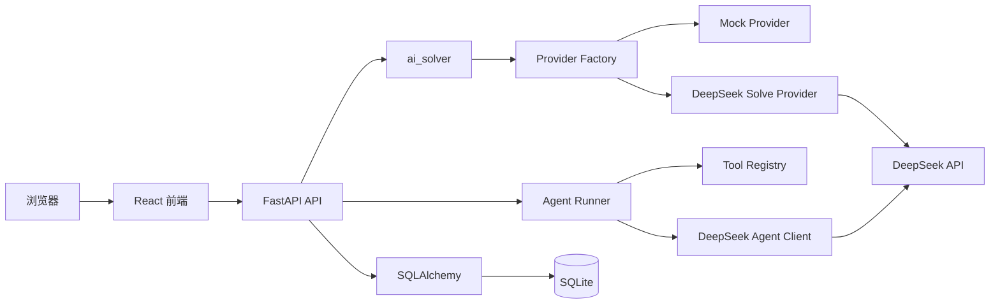

# 架构说明

## 总体结构

LeetCode Copilot 使用前后端分离架构：



当前阶段已启用 React 解题、历史、详情和题型复盘页面、可配置 Mock / DeepSeek Provider、单 Agent 题目导师，以及 SQLAlchemy/SQLite 持久化。无 API Key 时使用 Mock；有 Key 时使用 `deepseek-v4-flash`。

## 前端分层

```text
frontend/src/
├── components/  # 可复用展示和输入组件
├── pages/       # 路由页面
├── App.tsx      # 路由和全局布局
├── main.tsx     # 应用入口
└── index.css    # Tailwind 和全局设计变量
```

## 后端分层

```text
backend/app/
├── api/         # HTTP 路由
├── core/        # 环境配置
├── db/          # Engine、Session 和建表
├── services/    # AI Provider 和业务服务
├── models/      # 数据库模型
├── schemas/     # 请求和响应结构
└── main.py      # FastAPI 入口
```

## 扩展原则

- API 层只处理 HTTP 输入输出，不承载解题逻辑。
- AI 调用封装在 `services/ai/providers`，统一返回 `ProblemSolution`。
- Provider Factory 只根据后端 API Key 选择 Mock 或 DeepSeek，不静默降级。
- 模型 JSON 结果必须先通过 Pydantic 校验，成功后才能进入数据库事务。
- Agent 通过 `services/agent` 中的 Runner、Model Client 和 Tool Registry 工作。
- Agent 只能调用题目上下文、相似题、学习画像、学习记忆和学习记录更新五个白名单工具。
- 一次 Agent 回合的消息、工具轨迹和记忆使用同一事务，失败时全部回滚。
- 更新掌握状态或备注的 Tool Call 必须由用户二次确认。
- Pydantic schema 与数据库 model 分离。
- 请求级 Session 通过 FastAPI 依赖注入，写入失败时回滚事务。
- 分类统计由后端基于现有题目和标签关系实时聚合，不维护冗余统计表。
- 前端页面通过可复用组件组合，不直接拼接后端 URL。
- 前端 API 请求集中在 `src/api`，请求和响应类型集中在 `src/types`。
