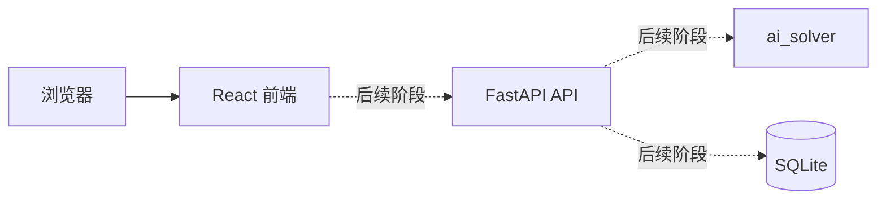

# 架构说明

## 总体结构

LeetCode Copilot 使用前后端分离架构：



当前阶段只启用 React 页面骨架和 FastAPI 的 `GET /health`。虚线链路将在后续 MVP 阶段实现。

## 前端分层

```text
frontend/src/
├── components/  # 可复用展示和输入组件
├── pages/       # 路由页面
├── App.tsx      # 路由和全局布局
├── main.tsx     # 应用入口
└── index.css    # Tailwind 和全局设计变量
```

## 后端分层

```text
backend/app/
├── api/         # HTTP 路由
├── services/    # AI 和业务服务
├── models/      # 数据库模型
├── schemas/     # 请求和响应结构
└── main.py      # FastAPI 入口
```

## 扩展原则

- API 层只处理 HTTP 输入输出，不承载解题逻辑。
- AI 调用封装在 `services`，便于从 mock 切换到真实提供商。
- Pydantic schema 与数据库 model 分离。
- 前端页面通过可复用组件组合，API 访问将在独立模块中实现。

