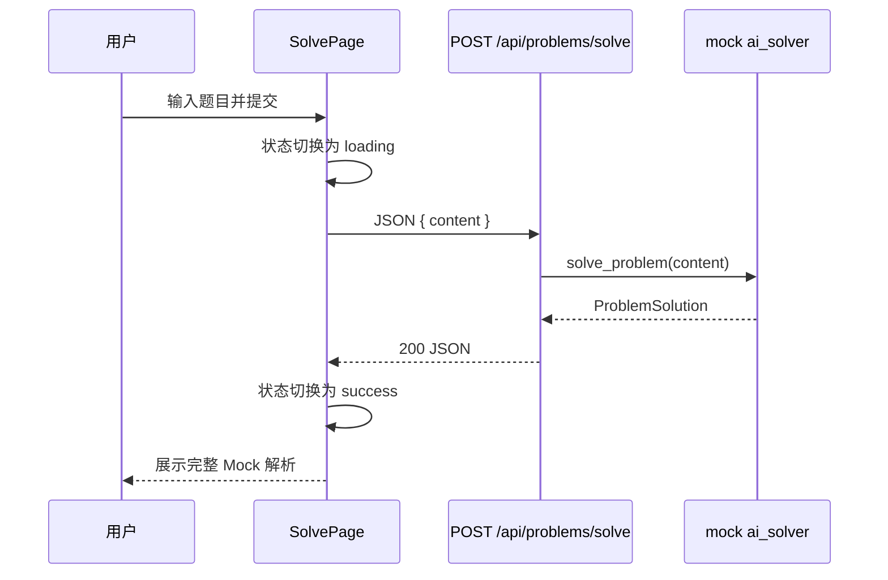

# Mock 解题闭环设计

## 目标

打通 LeetCode Copilot 的第一条完整业务链路：用户在 `/solve` 输入题目文本，前端调用后端 `POST /api/problems/solve`，后端通过确定性的 mock `ai_solver` 返回结构化解析，前端展示完整结果。

本阶段用于验证接口契约、状态管理和结果展示。它不使用 SQLite，不调用真实大模型，也不根据输入内容生成真实答案。

## 方案选择

采用固定“两数之和”Mock 响应。所有满足校验的输入都返回同一份完整解析，并在结果区域明确标记 `MOCK_RESULT`。

选择该方案的原因：

- 输出稳定，便于验证接口和前端展示。
- 自动化测试可以精确断言响应。
- 不通过关键词匹配或随机文本伪装真实 AI 能力。
- 后续替换 `ai_solver` 内部实现时，不需要改变路由或前端接口。

## 后端设计

### 请求 Schema

`ProblemSolveRequest` 包含：

- `content: string`：去除首尾空白后长度至少为 10。

### 响应 Schema

`ProblemSolution` 包含：

- `title: string`
- `difficulty: string`
- `tags: string[]`
- `problem_summary: string`
- `solution_approach: string`
- `algorithm_reason: string`
- `python_code: string`
- `code_explanation: string[]`
- `time_complexity: string`
- `space_complexity: string`
- `common_mistakes: string[]`
- `edge_cases: string[]`
- `teaching_analysis: string`

### Service

`app/services/ai_solver.py` 提供：

```python
def solve_problem(problem_content: str) -> ProblemSolution:
    ...
```

服务接收题目文本以保持未来接口稳定，但当前只返回固定“两数之和”解析。路由不包含 Mock 数据正文。

### Route

`POST /api/problems/solve`：

1. FastAPI/Pydantic 校验请求。
2. 路由调用 `solve_problem()`。
3. 返回 `ProblemSolution`。

有效请求返回 `200`。少于 10 个非空白字符的输入返回 FastAPI 标准 `422`。

## 前端设计

### 类型与 API

- `src/types/problem.ts` 保存请求和响应 TypeScript 类型。
- `src/api/problems.ts` 封装 `solveProblem(content)`。
- API 基础地址从 `VITE_API_BASE_URL` 读取，默认使用 `http://127.0.0.1:8000`。

页面和组件不直接拼接接口 URL。

### 页面状态

`SolvePage` 管理四种状态：

- `idle`：尚未提交，显示说明。
- `loading`：请求进行中，禁用输入提交按钮并显示“正在分析”。
- `success`：展示完整结构化结果。
- `error`：显示可读错误信息，保留输入内容以便重试。

新请求开始时清除旧错误；请求成功后清除旧结果并替换为新结果。

### 组件职责

- `ProblemInput`：管理文本输入并触发提交；通过属性接收禁用状态和按钮文案。
- `SolutionPanel`：接收 `ProblemSolution` 并展示所有字段；无结果时展示 idle、loading 或 error 状态。
- `CodeBlock`：展示 Python 代码。
- `TagBadge`：展示算法标签。

结果头部固定显示 `MOCK_RESULT`，避免用户把当前内容误认为真实 AI 解析。

## 数据流



## 错误处理

- 前端在提交前检查去除空白后的长度，过短时直接提示。
- 后端仍执行同样的长度校验，不能依赖前端校验。
- 非 `2xx` 响应由 API 模块转换为统一错误。
- 网络错误提示用户确认后端服务是否运行。
- 本阶段不实现自动重试、错误上报或全局 Toast。

## 测试

后端测试覆盖：

- 有效题目返回 `200`。
- 响应包含全部约定字段。
- 固定 Mock 内容和复杂度符合预期。
- 空白或过短内容返回 `422`。
- `ai_solver` 返回符合 Schema 的对象。

前端验证覆盖：

- TypeScript 和 Vite 生产构建通过。
- 浏览器输入示例题目后按钮可提交。
- 提交后展示 `MOCK_RESULT`、标题、标签、代码和复杂度。
- 浏览器控制台无错误。

## 验收标准

- `/solve` 的提交按钮不再永久禁用。
- 有效输入能够完成一次真实 HTTP 往返。
- 页面展示需求中列出的 13 类解析内容。
- 过短输入不会发出请求，并显示明确提示。
- 后端不包含数据库代码或外部 AI SDK。
- 关闭后端时，前端显示可恢复的错误状态且不丢失输入。

## 后续扩展

下一阶段可在保持 `ProblemSolveRequest` 和 `ProblemSolution` 契约的基础上增加 SQLite 持久化。真实 AI 接入只替换或扩展 service 层，不改变当前页面与路由职责。
