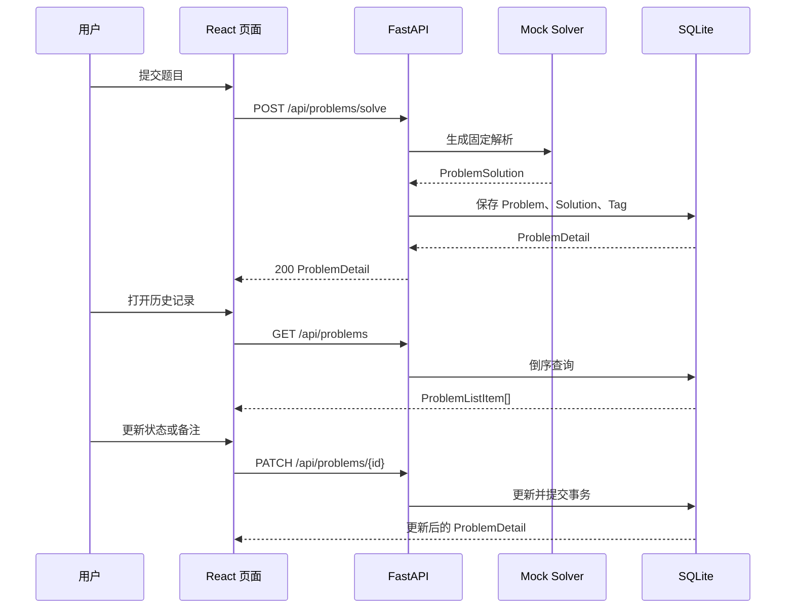

# SQLite 持久化与历史记录设计

## 目标

在现有 Mock 解题链路上增加 SQLite 持久化，使每次成功解题都形成一条可回看的学习记录。用户能够浏览历史记录、打开题目详情，并修改掌握状态和个人备注。

本阶段不改变 Mock Solver 的生成方式，不接入真实 AI，也不实现分类统计、搜索、删除或分页。

## 技术方案

使用 SQLAlchemy 2.0 ORM 和 SQLite。数据拆分为 `Problem`、`Solution` 和 `Tag` 三类模型：

- `Problem` 保存原题、基础元数据和学习状态。
- `Solution` 保存一对一的完整解析。
- `Tag` 通过关联表与题目建立多对多关系。

该结构比单张宽表更容易理解和维护，也为后续标签统计、替换数据库和扩展解析版本保留清晰边界。

## 数据模型

### Problem

表名：`problems`

- `id: integer`：自增主键。
- `original_content: text`：用户提交的原始题目。
- `title: string`：解析标题。
- `difficulty: string`：难度。
- `mastery_status: string`：`未掌握`、`学习中` 或 `已掌握`，默认 `未掌握`。
- `personal_notes: text`：个人备注，默认空字符串。
- `created_at: datetime`：创建时间。
- `updated_at: datetime`：最后更新时间。

### Solution

表名：`solutions`

- `id: integer`：自增主键。
- `problem_id: integer`：唯一外键，关联 `problems.id`。
- `problem_summary: text`
- `solution_approach: text`
- `algorithm_reason: text`
- `python_code: text`
- `code_explanation: JSON`
- `time_complexity: string`
- `space_complexity: string`
- `common_mistakes: JSON`
- `edge_cases: JSON`
- `teaching_analysis: text`

删除题目时由 ORM 级联删除解析。当前阶段不提供删除接口。

### Tag

表名：`tags`

- `id: integer`：自增主键。
- `name: string`：唯一标签名称。

关联表 `problem_tags` 包含 `problem_id` 和 `tag_id` 联合主键。

每次保存解析时复用已经存在的同名标签。标签本身不会因为题目删除而自动删除。

## 数据库基础设施

新增 `app/db/`：

- `base.py`：声明 SQLAlchemy `Base`。
- `database.py`：创建 engine、session factory 和请求级 `get_db()`。
- `init_db()`：创建数据目录并调用 `Base.metadata.create_all()`。

开发数据库默认位于：

```text
backend/data/leetcode_copilot.db
```

FastAPI 使用 lifespan 在启动时执行 `init_db()`。数据库 Session 按请求创建并在请求结束后关闭。

当前阶段不引入 Alembic。模型发生不兼容修改前必须先增加正式迁移方案。

## Schema

### ProblemListItem

- `problem_id`
- `title`
- `difficulty`
- `tags`
- `mastery_status`
- `created_at`

### ProblemDetail

包含：

- `problem_id`
- `original_content`
- `title`
- `difficulty`
- `tags`
- 所有 `ProblemSolution` 解析字段
- `mastery_status`
- `personal_notes`
- `created_at`
- `updated_at`

### ProblemUpdateRequest

- `mastery_status`：可选，但只能是三个允许状态之一。
- `personal_notes`：可选，最长 5000 字符。

请求必须至少提供一个字段。空对象返回 `422`。

## 后端服务边界

新增 `problem_service`，负责：

- 把 Mock Solver 结果保存为 Problem、Solution 和 Tag。
- 查询历史记录。
- 查询单条完整详情。
- 更新掌握状态和备注。
- 把 ORM 对象转换为响应 Schema。

API 路由只处理 HTTP 输入输出和 `404` 映射，不直接编写查询。

保存操作在单个事务中完成。任何写入失败都会回滚，不留下半条记录。

## API

### `POST /api/problems/solve`

流程：

1. 校验题目文本。
2. 调用 Mock Solver。
3. 在同一事务内保存题目、解析和标签。
4. 返回 `ProblemDetail`。

保持 HTTP `200`，避免改变现有前端提交语义。每次请求都新增记录，当前不做内容去重。

### `GET /api/problems`

返回 `ProblemListItem[]`，按 `created_at` 和 `id` 倒序排列。本阶段不分页。

### `GET /api/problems/{problem_id}`

返回 `ProblemDetail`。记录不存在时返回 `404`。

### `PATCH /api/problems/{problem_id}`

部分更新掌握状态和个人备注，成功后返回更新后的 `ProblemDetail`。记录不存在时返回 `404`。

## 前端

### API 与类型

扩展 `src/types/problem.ts`：

- `MasteryStatus`
- `ProblemListItem`
- `ProblemDetail`
- `ProblemUpdateRequest`

扩展 `src/api/problems.ts`：

- `getProblems()`
- `getProblem(problemId)`
- `updateProblem(problemId, updates)`

`solveProblem()` 返回类型从 `ProblemSolution` 调整为 `ProblemDetail`。

### HistoryPage

- 首次进入时请求历史记录。
- 显示加载、空数据和错误状态。
- 使用真实 `ProblemCard` 渲染标题、难度、标签和掌握状态。
- 点击卡片进入 `/problems/{problem_id}`。

### ProblemDetailPage

- 根据路由参数请求完整详情。
- 复用 `SolutionPanel` 展示解析。
- 展示原题文本。
- 使用原生 `select` 修改掌握状态。
- 使用 `textarea` 编辑个人备注。
- 点击“保存学习记录”调用 PATCH。
- 保存期间禁用按钮；成功后显示明确的已保存状态；失败时保留用户输入。

## 数据流



## 错误处理

- 数据库写入失败时回滚 Session。
- 数据库内部异常不向前端暴露堆栈或 SQL。
- 不存在的题目返回 `404` 和可读错误信息。
- 无效掌握状态、超长备注或空 PATCH 返回 `422`。
- 前端分别处理加载失败和保存失败，不清空已加载详情或用户尚未保存的备注。

## 测试

后端测试使用独立临时 SQLite 数据库，并通过 FastAPI 依赖覆盖注入测试 Session。

覆盖：

- 成功解题后数据库中存在 Problem、Solution 和标签关联。
- 连续解题会创建两条记录。
- 历史记录按最新优先返回。
- 详情包含完整解析。
- PATCH 能分别和同时更新状态、备注。
- 非法 PATCH 返回 `422`。
- 不存在的 ID 返回 `404`。
- 数据在应用重新创建 Session 后仍可查询。

前端验证：

- TypeScript/Vite 构建通过。
- 浏览器完成解题提交后，历史页面出现新记录。
- 点击记录可进入详情页。
- 修改状态和备注后保存成功，刷新页面仍保持更新结果。
- 页面控制台无错误。

## 验收标准

- 成功解题自动保存到 `backend/data/leetcode_copilot.db`。
- 历史页面不再使用静态示例。
- 详情页面不再使用静态解析。
- 掌握状态和个人备注可保存并在刷新后恢复。
- 测试不会读写开发数据库。
- 当前 Mock 解题页面的提交与展示行为保持可用。
