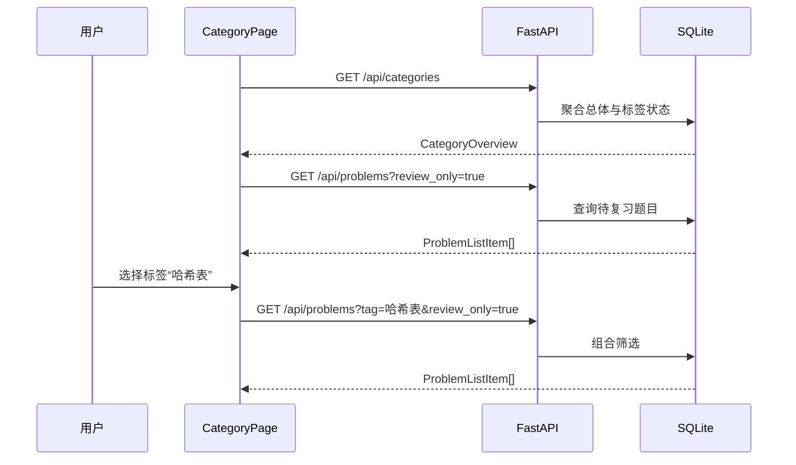

# 题型归纳与复盘设计

## 目标

基于已有 SQLite 学习记录实现题型归纳与待复习队列。用户可以看到总体掌握情况、按标签识别薄弱题型，并筛选需要复习的题目。

本阶段只使用现有题目、标签和掌握状态数据，不增加统计表，不接入图表库，也不生成 AI 个性化建议。

## 方案选择

采用后端实时聚合、前端展示结果的方案。

- 统计规则只存在于后端，避免前后端计算不一致。
- 数据库直接完成筛选和计数，不需要把全部详情传到浏览器。
- 当前数据量不需要缓存或预计算统计表。
- 后续切换 PostgreSQL 或增加分页时，前端契约可以保持稳定。

不采用：

- 前端读取全部历史后自行统计：规则分散，数据量增长后开销过大。
- 新建统计表并在写入时维护：当前阶段增加了不必要的一致性成本。

## 统计规则

### 总体统计

总体统计以唯一题目为单位：

- `total_problems`：题目总数。
- `mastered_problems`：掌握状态为 `已掌握` 的题目数。
- `review_problems`：掌握状态为 `未掌握` 或 `学习中` 的题目数。
- `mastery_rate`：`mastered_problems / total_problems * 100`。

数据库为空时，`mastery_rate` 返回 `0.0`，前端显示空状态而不是把它解释为薄弱结论。

### 标签统计

同一道题有多个标签时，分别计入每个标签。

每个标签包含：

- `tag`
- `total_count`
- `unmastered_count`
- `learning_count`
- `mastered_count`
- `review_count`：`unmastered_count + learning_count`
- `mastery_rate`：`mastered_count / total_count * 100`

所有百分比限制在 `0.0` 到 `100.0`，四舍五入保留 1 位小数。

标签排序：

1. `review_count` 降序。
2. `mastery_rate` 升序。
3. 标签名称升序。

该顺序使待复习题目最多、掌握率最低的标签优先出现。

## 后端 Schema

### CategoryStats

```text
tag: string
total_count: integer
unmastered_count: integer
learning_count: integer
mastered_count: integer
review_count: integer
mastery_rate: float
```

### CategoryOverview

```text
total_problems: integer
mastered_problems: integer
review_problems: integer
mastery_rate: float
categories: CategoryStats[]
```

## API

### `GET /api/categories`

返回 `CategoryOverview`。

空数据库响应：

```json
{
  "total_problems": 0,
  "mastered_problems": 0,
  "review_problems": 0,
  "mastery_rate": 0.0,
  "categories": []
}
```

### `GET /api/problems`

在现有接口上增加可选查询参数：

- `tag: string | null`：按标签名称精确筛选，去除首尾空白后长度为 1 到 100。
- `review_only: boolean`：默认 `false`。为 `true` 时只返回 `未掌握` 和 `学习中` 的题目。

两个参数可以组合：

```text
GET /api/problems?tag=哈希表&review_only=true
```

不存在的标签返回空数组。空白标签或超过 100 个字符的标签返回 `422`。列表仍按创建时间和 ID 倒序排列。

## 后端职责

新增 `category_service`：

- 查询总体唯一题目统计。
- 按标签聚合三个掌握状态。
- 计算并规范化百分比。
- 按薄弱程度排序标签。

扩展 `problem_service.list_problems()`：

- 接受可选标签和 `review_only` 参数。
- 在 SQL 查询中完成筛选。
- 保持现有列表响应结构。

路由只解析查询参数并调用服务，不复制统计逻辑。

## 前端类型与 API

扩展 `src/types/problem.ts`：

- `CategoryStats`
- `CategoryOverview`
- `ProblemListFilters`

扩展 API：

- `getCategories()`
- `getProblems(filters?)`

查询参数通过 `URLSearchParams` 构建，不手工拼接未编码的标签。

## CategoryPage

页面分为三层：

### 总体概览

展示：

- 总题数
- 已掌握数
- 待复习数
- 总体掌握率

不引入图表库。掌握率使用现有钴蓝色和清晰数字表达。

### 题型卡片

- 每张卡片展示标签、总题数、三个状态数量和掌握率。
- 默认按后端薄弱程度顺序显示。
- 点击卡片选择标签；再次点击已选标签恢复“全部标签”。
- 选中状态使用现有 `mist` 背景和 `cobalt` 边框，不增加新的视觉系统。

### 复习题目列表

- 默认模式为“待复习”。
- 可切换“待复习”和“全部记录”。
- 标签选择或模式变化时重新请求题目列表。
- 使用现有 `ProblemCard`，点击进入题目详情。
- 当前筛选无结果时显示明确空状态：
  - 待复习为空：`该范围内没有待复习题目。`
  - 全部记录为空：`该范围内还没有刷题记录。`

## 页面状态

分类概览和题目列表分别维护加载与错误状态：

- 概览失败不显示虚假统计。
- 列表失败不清空已成功加载的概览。
- 切换筛选时保留题型卡片，只更新题目列表区域。
- 新请求完成前显示明确的加载状态。

本阶段不实现自动重试、分页和 URL 查询参数同步。

## 数据流



## 错误处理

- 查询参数无效时 FastAPI 返回 `422`。
- 数据库错误不向响应暴露 SQL 或堆栈。
- 前端显示面向用户的加载失败信息。
- 分类为空和筛选为空属于正常状态，不当作错误。

## 测试

后端测试使用独立临时 SQLite：

- 空数据库统计。
- 总体题数、已掌握数、待复习数和掌握率。
- 三种掌握状态的标签计数。
- 多标签题目分别计数，但总体只计一次。
- 百分比保留 1 位小数。
- 薄弱题型排序规则。
- 标签筛选。
- 待复习筛选。
- 标签与待复习组合筛选。
- 空白或过长标签返回 `422`。

前端验证：

- TypeScript/Vite 生产构建通过。
- 分类页显示开发数据库的真实统计。
- 点击标签后题目列表正确变化。
- “待复习”和“全部记录”切换正确。
- 题目卡片可以进入详情页。
- 页面无横向溢出，控制台无错误。

## 验收标准

- `CategoryPage` 不再包含静态分类示例。
- 分类统计完全来自 SQLite。
- 当前开发数据能够显示“数组”和“哈希表”的真实计数。
- 状态更新后刷新分类页，统计结果同步变化。
- 待复习队列能够直接进入题目详情。
- 当前解题、历史、详情和备注保存功能保持可用。

## 明确排除

- 图表库和复杂数据可视化
- 时间趋势和连续学习天数
- 定时提醒或通知
- 复习间隔算法
- AI 个性化复习建议
- 分页、搜索和排序控件
